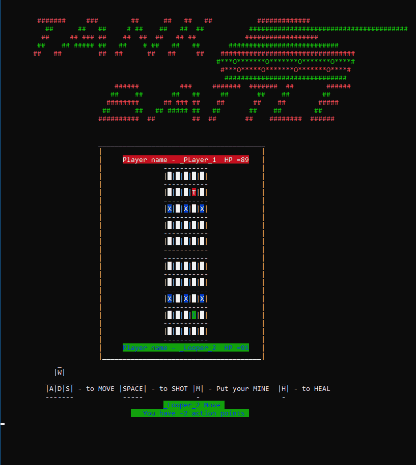

+ **Год выпуска: 2020**
+ **Жанр: Тактическая пошаговая стратегия**
+ **Платформа: PC Win 10**
+ **Тип изданий: Open Source**
___
 **Консольная игра для Windows «Tank Battle» написанная на языке C++ и рассчитанна на двоих игроков.** 
___
### Авторы:
+ [**© Олисов Сергей\(SergeyOlisov\)**](https://github.com/SergeyOlisov)
+ [**© Рязанцев Илья\(RID1991-IT\)**](https://github.com/RID1991-IT)
+ [**© Присяжных Сергей\(Sergey-Prisyzhnykh-IT\)**](https://github.com/Sergey-Prisyzhnykh-IT)
___
### Процесс игры:

___
### Правила Игры :
+ Игра для 2-их игроков
+ На поле расположены два танка (1-игрок красный, 2-игрок зеленый). Цель игры уничтожить танк противника. Передвижение танка осуществляется клавишами “W” ”A” ”S” ”D”  . Танки способны стрелять на клавишу “Space”. Ставить мину, для этого необходимо нажать клавишу “M”, выбрать место на поле противника и клавишей “Enter” поставить мину (мину можно ставить один раз за ход). Так же танки способны восстанавливать своё HP, для этого необходимо нажать клавишу “H”. Далее эта способность будет не доступна в течении 4 ходов. За один ход игрок может совершить 3 действия. 
+ На полях обоих игроков расположены противотанковые ежи, если игрок врезается в это препятствие, то у него отнимается 1 очко действие и 2 единицы прочности танка(-2HP). 
+ Побеждает игрок который первый отнимет все очки прочности (HP) у соперника. 
___

___

___

### <a name="Get">Начало работы:</a>

Скопируйте файл .exe в любое место на вашем компьютере. Если у вас установлена программа Visual Studio, игра запустится.  
Если программа Visual Studio не установлена, система может запросить следующие файлы: msvcp140d.dll, vcruntime140.dll, ucrtbased.dll —  это компоненты пакета от корпорации Microsoft Visual C++ 2015.  
Скачайте данные файлы и разместите в корневой директории windows:  
- C:\Windows\System32 для x32 системы;
- C:\Windows\SysWOW64 для x64 системы.  
Перезагрузите компьютер и запустите программу.

***Скачать файлы для Windows 10 и других версий можно пройдя по ссылкам:***  

Для x64:  

- [msvcp140d.dll](http://dlltop.ru//files/msvcp140d-64.zip)  
-	[vcruntime140.dll](http://dlltop.ru//files/vcruntime140-64.zip)  
-	[ucrtbased.dll](http://dlltop.ru//files/ucrtbase-64.zip )  

Для x32: 

-	[msvcp140d.dll](http://dlltop.ru//files/msvcp140d.zip)  
-	[vcruntime140.dll](http://dlltop.ru//files/vcruntime140.zip)  
-	[ucrtbased.dll](http://dlltop.ru//files/ucrtbase.zip)  
