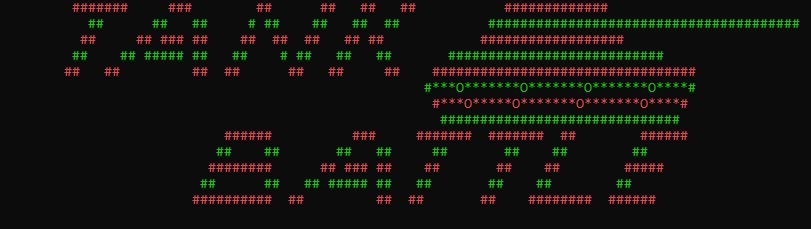
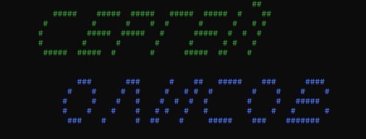
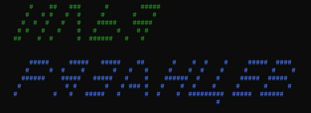
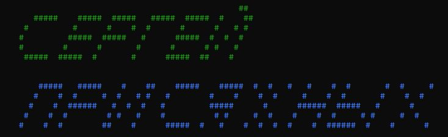

+ **Год выпуска: 2019**
+ **Жанр: Тактическая пошаговая стратегия**
+ **Платформа: PC Win 10**
+ **Тип изданий: Open Source**
___
Консольная игра для Windows «Tank Battle» написанная на языке C++ и рассчитанна на двоих игроков. 
___
### Правила Игры :
+ Игра для 2-их игроков
+На поле расположены два танка (1-игрок красный, 2-игрок зеленый). Цель игры уничтожить танк противника. Передвижение танка осуществляется клавишами “W” ”A” ”S” ”D”  . Танки способны стрелять на клавишу “Space”. Ставить мину, для этого необходимо нажать клавишу “M”, выбрать место на поле противника и клавишей “Enter” поставить мину (мину можно ставить один раз за ход). Так же танки способны восстанавливать своё HP, для этого необходимо нажать клавишу “H”. Далее эта способность будет не доступна в течении 4 ходов. За один ход игрок может совершить 3 действия. 
+ На полях обоих игроков расположены противотанковые ежи, если игрок врезается в это препятствие, то у него отнимается 1 очко действие и 2 единицы прочности танка(-2HP). 
+ Побеждает игрок который первый отнимет все очки прочности (HP) у соперника. 
___
### Авторы:

___

___
